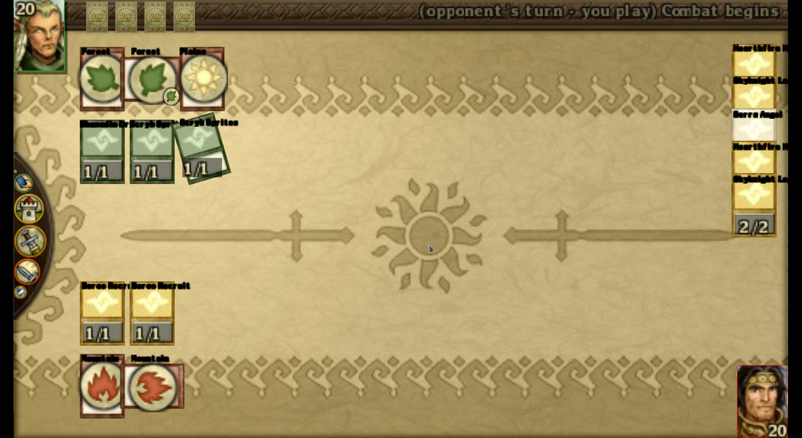

# Wagic: War of the Homebrew

*War of the Homebrew* is an open source collectible trading card game. You play as a wizard against the CPU with your army of minions. You start the game with a small collection of cards (symbolizing creatures and spells), and as you win battles against the AI, you earn credits that allow you to buy more cards and build more powerful decks. As you play, you unlock cards and new game modes, so it is much more than a simple card simulation. 

*WotH* features several thousands of cards (*currently over 9000 unique cards*) and is playable on multiple platforms.

It is based on [Wagic the Homebrew] in version 0.18.6 ([released](https://wololo.net/download/) in 2012). *War of the Homebrew* should be compatible with all mods create for this particular *Wagic* version.

[Wagic the Homebrew]: https://github.com/WagicProject/wagic

## Documentation

* [Manual](./doc/manual/manual.md)
* [Building](./doc/build.md)
* [Scripting](./doc/card_scripting.md)
