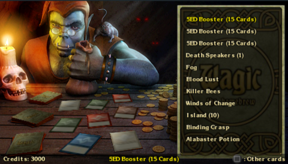

*Wagic: War of the Homebrew?!* is not intended to be used in any way which infringes upon the rights of others. Repeated use of this product may result in dizziness, exhaustion, and involuntary planeswalking.

**Please play Wagic responsibly.**

# Introduction

*Ye who seek arcane and esoteric homebrew games, seek no further: You have found Wagic, the Homebrew.*

## What is Wagic?

Wagic is a collectible card game engine for the PSP. Its primary design is to simulate a certain famous collectible card game, but the engine is flexible enough to support a range of designs. It’s also extendable, either through adding new cards or changing the source code. That’s right, Wagic is open source software. It’s primarily coded and maintained by Wololo, but has benefited from a number of contributions, including art, music, sound effects, cards, and code.

Players assemble decks and duel, either against each other or the AI. Winning duels unlocks new cards and rewards the player with credits, which can be spent at the shop. There are a number of hidden secrets to unlock, as well. Work hard and something good will happen!

Wagic is continously being updated with new cards and new code. For the latest news, be sure to visit [http://www.wololo.net/wagic](http://www.wololo.net/wagic). The forum (at [http://www.wololo.net/forum](http://www.wololo.net/forum)) is the central hub for game customization, while up-to-the-minute copies of the code can be checked out from Github at the project page [https://github.com/zie87/wth_woth](https://github.com/zie87/wth_woth)

# Setting up

*An unadorned card is an uninteresting card. Visit the Wagic forums to find many custom card sets, including new card art!*

## The Main Menu

Immediately after Wagic loads all its needed files you’ll be greeted by the main menu. Navigate the options using the D-Pad, and make a selection using  the button. From left to right, the options are: Play, Deck Editor, Shop, Settings, and Exit.

The first time you launch Wagic, a random collection of cards is given to you, as well as enough lands to build a deck of any color. You are also provided with credits to buy a few new cards in the shop.

While building a custom deck is an important part of the Wagic experience, if you’d like to begin playing right away you can use one of the premade decks provided. Just select the play menu item, then choose a deck. Note that once you’ve built your first deck, these premade decks are no longer available to you.

# Playing the game

*He who knows the rules, rules all. If you don’t know how to play, find a rulebook!*

## The Game Phases

 **The untap step.** Wagic will automatically untap any cards that may be untapped now. Some cards do not untap.

 **The upkeep step.** All upkeep costs must be paid during this step.

 **The draw step.** Wagic will deal you one card from your library into your hand. If you have no cards left to be dealt, you lose.

 **The first main phase.** Except for instants and cards with certain special abilities, cards can only be played during a main phase.

 **Beginning of combat.** This is an opportunity to cast spells and activate abilities that may alter the course of battle.

 **Declare attackers.** Choose which creatures will attack your opponent. Those that are tapped or recently played can’t attack.

 **Declare blockers.** The defending player decides which creatures will block the opponent. Tapped creatures can’t block.

 **Combat damage.** Unblocked attackers deal damage to the target player. Creatures dealt damage equal to their toughness die.

 **End of combat.** Cast instants and abilities before your second main phase.

 **Second main phase.** Identical to the first main phase. You may only play one land card per turn, during either main phase.

 **End step.** Abilities that trigger *“at the end of the turn”* occur now.

 **Cleanup.** If the current player has more than seven cards in their hand, they are forced to discard the extras.

# Dueling

*One who enters battle unprepared must be prepared for defeat. Arm yourself and prepare for victory!*

## Starting a Game

So, you’re ready to begin playing? If you think you can figure it out on your own, feel free to jump in! Otherwise, here’s a handy introduction. Note that every game is different, so you’ll likely encounter different situations than those listed here.

In this card game, specific rules *(those listed on cards)* always override general rules *(those in the rulebook)*. Just remember to read the cards carefully and you should be fine.

To start with, you’ll have to begin a new game. Just navigate over to the Play button (it’s on the far left) and press .

After selecting ***Play Game*** mode, menus will popup asking you to first select a deck, then an AI opponent. If you haven’t taken the time to create any decks, you can play with one of the prebuilt ones. There are many opponents to choose from, but the “Alliance” deck uses particularly straightforward mechanics.

## Duel Overview

This is the basic dueling screen: your play area is on the bottom, and the opponent’s area is on the top. The current phase of the game is displayed iconically on the left hand side of the screen, and written out at the top right. Both players have a portrait (used whenever you must choose *“target player”*), a graveyard, library, and a hand. The numbers symbolize either amount of cards in the pile (for graveyard and library), or total number of life points (for the portraits).

## Playing (and using) cards

It is your turn, so press  to show your hand.

Select a card using the left and right buttons, and use circle to put it into play. Once a card is in play, it can be tapped (used) with .

Now would be a good time to play a land. Select a land and press .

## Tapping for mana

When you tap a land, mana appears along the left side of the screen. This mana is used to power spells and abilities in the same way: you tap the lands you need, then click on the card that has the ability.

## Spells, abilities, and targets

In most cases, playing a card from your hand is called “playing a spell”, while using a card on the battlefield involves “using an ability”. While many spells and abilities work without any extra fuss, you’ll often find yourself needing to choose a target. Using these spells will automatically put you into “targetting mode”.

When you’ve entered targetting mode, a thin red rectangle will appear on the borders of your screen, and invalid targets will be grayed out. Navigate to a brightly lit card (or player portrait), and click on it with  to select it as a target. You can cancel target mode at any time by pressing .

In rare cases, a spell can have several targets. These spells require you to click on the card you’re casting again to confirm your targets. For example, if I want to cast a fireball on my opponent and one of his creatures: I tap for mana, show my hand (), and select the fireball () to begin casting. I then hide my hand, select my opponent’s portrait (), and the creature (), show my hand again, and then finally click on the fireball to confirm. Sounds complex in theory, but it’s really simple in practice.

**Remember!**

*  confirms a selection and  cancels it.
*  shows and hides the hand,
*  advances to the next phase.

## Attacking and Blocking

Dueling isn’t just tossing spells back and forth, of course. A large part of dueling is the battle between creatures! When it’s your turn, you can select attackers (using ) to send against your enemy. If they aren’t blocked by a creature, your attackers will deal damage directly to the enemy.

But what to do when you’re under attack? Use  to select creatures as blockers. Use  again to move a particular blocker to a new attacker. Try to create matches where your creature’s toughness (the second number) is higher than the enemy’s power (the first number), otherwise your blocking creatures will die.

## Interrupts

At many times (after a spell or when changing phases) the game will ask if you want to interrupt. Interrupting gives you the opportunity to counter your opponents strategies, or enhance your own.

Pressing  will start an interrupt, while  or  will decide not to. While interrupting, the rectangle around your portrait becomes red. If at any time you wish to cancel an interrupt, just press  again. Casting spells during an interrupt works just like normal, but keep in mind that, depending on what phase you’re in, only certain types of spells can be cast.

# Creating a deck

*The secret to Wagic mastery is practice. Practice, and proper deck building. Skillfully wield the deck editor!*

## The Deck Editor

Half the fun of Wagic comes from putting together the perfect deck of cards. To use the deck editor, navigate with the D-pad, add and remove cards using , press  to sell cards, and use the start menu to save or cancel your changes.

Note that you can build as many different decks as you’d like, all using the same cards from your collection. If you own two of a particular card, you may use it twice in each deck you build.

**Pro Tip:** Press  to show the deck overview, then  and  to view useful statistics.

# Buying cards

*Be wary of the merchant man, his prices change with supply and demand, yet he always makes a profit.*

## The Shop

The shopkeeper is a cunning soul, who convinces his customers to buy booster packs by limiting the selection of singles. Press  to view a list of all cards on display, or press  to ask for a new selection to choose from.

If you run out of credits, you’ll have to return to the deck editor to sell some cards, or play against the AI to win more. Winning against the AI also unlocks more cards for the shop to sell.

Wagic currently supports over three thousand cards, but without unlocking new sets you’ll only be able to play with a handful of them. If you get bored or frustrated, check out the forums for AI defeating strategies, user created sets, and more.

# Options

*Almost everyone knows what they want, but only the wise know how to achieve it. It’s too bad life doesn’t have an options menu.*

## Game Settings

Use the game settings to customize your experience. Navigate through the tabs using the  and  triggers, cycle through the available choices using the  button, and confirm or cancel with the start menu. Most options should be fairly selfexplanatory.

The **extra information** option will display text notifications when cards do things like going to the graveyard. Turning the **interrupt** options on might make turns take longer, but allows you more control over your turn. The **large cache** holds more card images in memory at once, but may sometimes cause the game to crash.

**Profiles** allow multiple players to use one PSP. Each profile has its own collection of cards, unlocked bonuses, and credits.

# Controls

*Sometimes it helps to know the right buttons to push, and the right time to push them.*

## General Navigation

|                                   |                                       |
|-----------------------------------|---------------------------------------|
| | Confirms selection                    |
|           | Cancels                               |
|   | Opens menu (usually to save or exit)  |

## Deck Editor

|                                   |                                       |
|-----------------------------------|---------------------------------------|
| | Add/remove card from deck             |
|           | Sell card                             |
|  | Switch between deck and collection    |
|| Show help screen/statistics           |
| | Change browsing speed                 |
|   | Save or cancel changes                |
|   | Save or cancel changes                |
|  | Browse statistics pages |

## Shop

|                                   |                                       |
|-----------------------------------|---------------------------------------|
| | Ask for price of card, buy card       |
|| Ask to see different cards            |
|   | Menu to exit (all purchases are saved)|

## Play

|                                   |                                               |
|-----------------------------------|-----------------------------------------------|
| | ***On card:*** activate card (tap, attack, etc)   |
| | ***On player:*** select as target                 |
| | ***On card pile:*** browse pile, if allowed to    |
| | ***Asked to interrupt:*** don’t interrupt         |
|           | ***Asked to interrupt:*** decide to interrupt     |
|           | Cancel interrupt, spell, or ability           |
|  | Open and close hand                           |
|  | Advance to next game step                     |
|   | Menu to exit                                  |

# Customization

*You supply the effort and the spare time; We’ll supply the opportunity. Help us make Wagic perfect!*

## New Cards

Adding new cards to Wagic can be a very rewarding experience. Use an image editing tool to make the card images (we recommend Magic Set Editor 2), then open up a copy of _cards.dat and start editing! The format can be a little confusing at first, but spend some time reading other cards and you’ll figure it out. Or visit [Github][0] and take a look at the [card editing guide][1].

[1]: https://github.com/zie87/wth_woth/blob/main/doc/card_scripting.md

## New Themes

If you’re of a graphical bent, try making your own theme. Save a copy of the graphics folder into the themes folder, renaming it to something unique (“themes/My Theme”, for example). Then feel free to replace any of those images. You can even replace the card images, by mirroring the sets folder structure (“themes/MyTheme/sets/10E/CardID.jpg”). Note that zipped files do not work for themes... if you want to replace a card, it has to be directly available.

## New Code

Want to implement a new card ability, or maybe change the way the system works internally? Check the source out from [Github][0] and hack away to your heart’s content. Create a pull request with a good patch and you might even get commit access.

[0]: https://github.com/zie87/wth_woth
# Notes

*Take note! A little piece of paper, can provide a little peace of mind.*